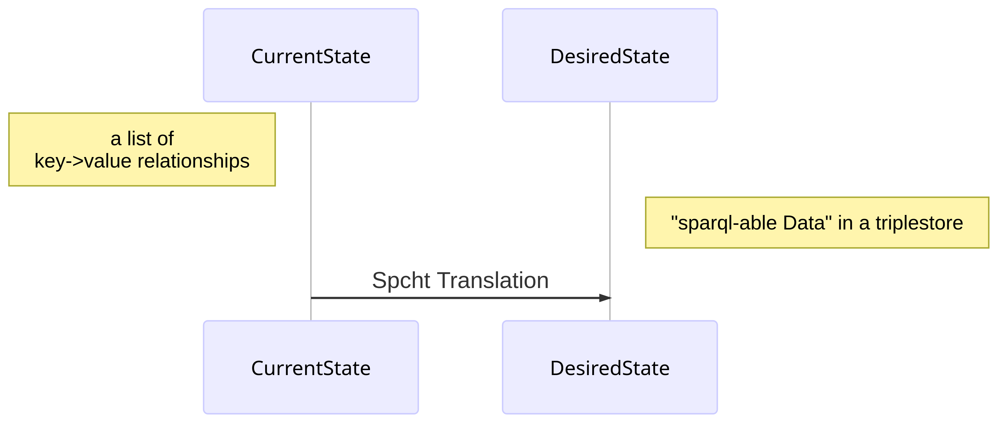

# Solr to Triplestore Bridge

This project started out under a vastly different name. In its first life it was a very tightly built small tool aiming to provide a singular job. That objective remained mostly the same but the scope grew a bit larger and so a decision was made: a tool evolved from the first one, took its place and now provides the ability to do more than a simple tool.

The project had already processed data from various sources in a search index, in this case an Apache Solr. On of the export formats of Solr is JSON,  which includes header informations and an object describing various attributes of media. This data should be transferred in a [triplestore](https://en.wikipedia.org/wiki/Triplestore), originally [OpenLink Virtuoso](https://virtuoso.openlinksw.com/) stored as RDF triples. For those triples another step has to be taken: each data-pair needs to be matched into the right kind of object. The first instance of this work was hard coded and found the mapping directly in the code. To preserve the ability to change things at a later point of time a new format was developed: the **spcht descriptor format** (*sdf*).

While other frameworks like [MetaFacture](https://github.com/metafacture) exists, these proved to be unwieldy. The format of the *sdf* is written in JSON and structured more simply. It cannot provide the same feature richness MetaFacture offers but runs easier. There is also a [GUI Tool](https://github.com/jpkanter/spcht_checker_gui) to provide guidance for the format itself.

## Content

The codebase is strictly divided in the actual framework for spcht and an implementation for this specific project.

## main.py

This is an actual implementation of the so called *SpchtProcessing*. It's a command line tool which specific description and can be accessed by calling `main.py --help`

## SpchtDiscriptorFormat.py

Contains the class for *SpchtProcessing* and all class-specific functions - an in-depth  [tutorial](./README/SpchtDescriptorDetails.md) is available. The exact format for the SpchtDescriptorFormat is defined in a [JsonSchema](./SpchtSchema.json).

### SpchtUtility.py

A list of not class-specific and otherwise handy scripts around the *SpchtProcessing* complex.

### SpchtErrors.py

A simple implementation of custom, Spcht-specific exception classes.

## WorkOrder.py

A set of functions around the "WorkOrder" procedures, a compartmentalized logic that allows for a continuation of any given processing, also implements data acquisition from Apache Solr and the insertion into a triplestore. In short, this does all the non-processing work.

### local_tools.py

Some auxiliary functions and procedures that "popped" into existence over the course of the project.

## Requirements

* `rdflib` >= 4.2.2
* `requests` >= 2.23.0
* `urrlib` >= 1.25.9
* `jsonschma` >= 3.2.0
* `pymarc` >= 4.0.0
* `python-datautil` >= 2.8.1

## Development Notes

Apart from very German capitalization of random words I would also like to lose a word about the programs and plug-ins I used for this. While the master can work with everything I would not consider myself as such.

I used [Intellij PyCharm](https://www.jetbrains.com/pycharm/)  with the following plug-ins:

* Rainbow Brackets - makes it easier to find the right entry point
* GitToolBox - for people that just forget most of the functionality git offers
* Comments Highlighter - Port of the Vs Code Plug-in _Better Comments_, makes comments a bit more colorful
* CodeGlance - provides a neat minimap for the code
* a bunch of standard plug-ins that come with PyCharm when you just install it

For writing markdown files I used [Typora](https://typora.io/).

