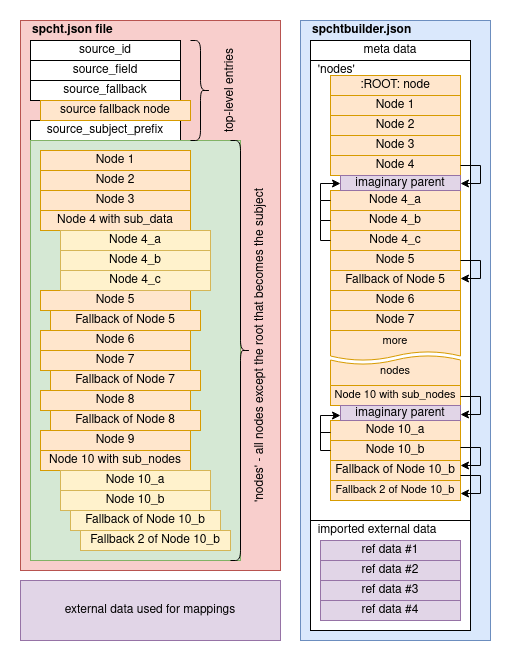

 

# Spcht Builder 

A spcht.json file is, in general terms, a tree like data structure that gets crawled over by a somewhat specialised program that interprets the given signals based on the data it got. Its a simple and blunt tool, similar to those wild-west self-playing pianos. It runs down its etchings and does things. This kind of structures seems fit for the given task. Spcht was created with the desire to make it possible to edit the files by hand, the main motivation for discarding more complex formats like XML. With further progress in the project a simple GUI was written to test if a given file is valid. Later it appeared that this tool could be improved and shortly after a full edit suit was conceived, violating the original thought. The resulting GUI is not always clear in its ways, to make it easier to understand how it works under the hood the following text was written.

As mentioned above, the tree-like structure, with all its branches, is somewhat human readable for edit-purposes but a night mare to get into a proper GUI when screen space is at a premium. Simply copying the tree structure might be confusing and outright mind numbing when used on more complex structures like the one used in foliotools. A main part of SpchtBuilder is the different file structures, it becomes more similar to a relational database than to a tree structure, a method to make the presented information more linear. 

The image shows the difference between the structures of the two file formats. The two formats should be convert into each other without losing any vital information. To preserve the aformentioned tree structure a spchtbuilder.json links nodes by their name. Hand written spcht.json files wont have any names despite it being a perfectly valid node-property. SpchtBuilder will generate names where it sees fit and maintain uniqueness among the names. While a name might be theoretically every UTF-8 character (which includes emojis) its strongly advised to keep to ASCII.
