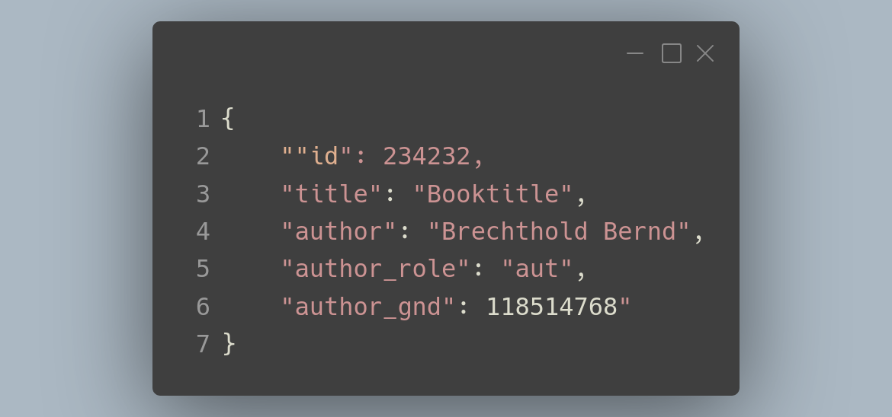
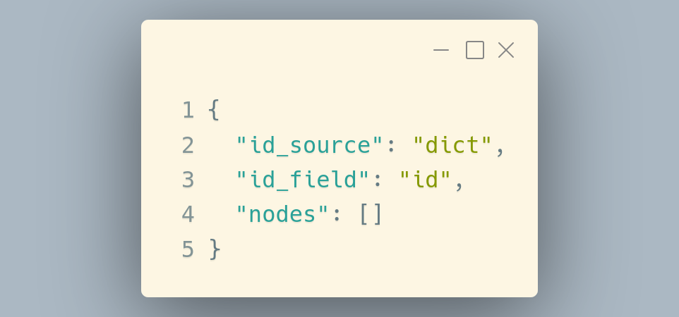
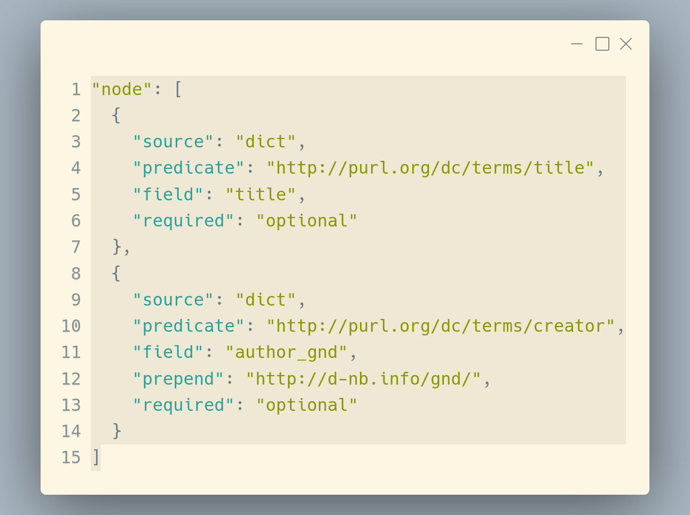
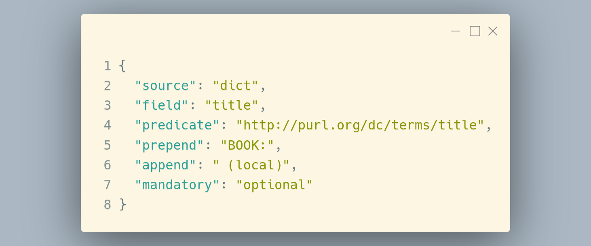
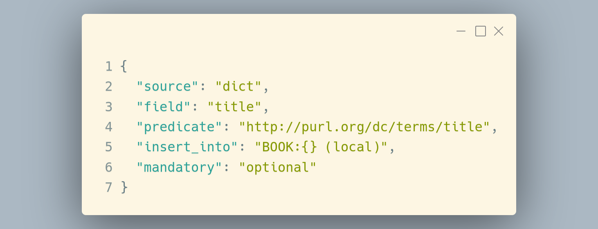
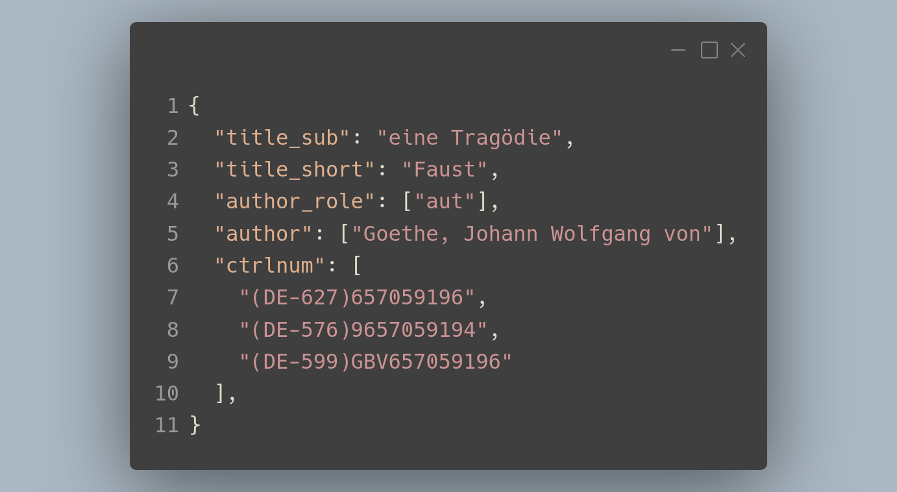

# Spcht Descriptor Format - in-depth explanation

## Introduction

The processing operation takes a set of data and creates *Linked Data* Triples of them. For that operation one has to understand the lowest unit in any triplestore looks:

`<subject> <predicate> "object"` or in more practical terms: 

`<https://data.finc.info/resources/0-1172721416> <dcmitype/issued> "2002"`

The first part is the so called *subject*, the middle is the *predicate* and the last is the *object*, the first two have to be some kind of *UR**I*** (not to be confused with an *UR**L***) but the *object* can be a literal string or another *URI*, referencing another object. A *triplestore* usually contains a tree-like structure, known as graph. 

The input data for which the Spcht descriptor was originally written is inherently linear and not tree-like, there is a distinct 1-dimensional character of those data that makes the transformation from a classical database considerable easier.

The data, JSON-formatted, looks like this: 



To generate a node from here we are taking one part, the *ID* as unique part for our subject, combined with a defined graph `https://example.info/data_` we get a full subject called `https://example.info/data_234232`, this forms the base root upon we can craft additional properties for this node.

We know the title and author of the book and which 'role' the author had in the creation of the book. A knowledgeable librarian chooses what properties match those data best and defines a *Spcht node* for each of those properties. 

In case of the title we take `dcmieterms/title` as agreed *predicate* for this kind of information, with this mapping defined we now have all three parts of our node defined. The end result would look like this:

`<https://example.info/data_234232> <dcmiterms/title> "Booktitle"`

While literal strings are easy to understand, they only possess a limited use for any further data operation. For this book we know also an author and what 'role' the author of this book had (they might have been a translator or publisher for instance). Other triplestores and databases have an extensive library of people that is fortunately linked by the key `author_gnd`, of the knowledge of the database our librarian can now write another node-description, stating that the field `author_gnd` contains an id that can be used to create an *URI* to further data. The result would look like this:

```
<https://example.info/data_234232> <dcmiterms/creator> 
	<http://d-nb.info/gnd/118514768>
```

Also of interest, we 'map' our author as 'creator' of this book instead of a generic 'contributor'. With this new data and many more similar nodes we can now use the data for linked data operations.

## Simplest structure

A Spcht descriptor file contains roughly two parts, the initial **Head** that describes the ID part of a triple and a list of **Nodes**. The Head itself is a node in itself and uses the same functions as any other node with the difference that the result must be a singular value.



This would do nothing, there might be a mapped *ID* per dataset, but as there is no actual data to create triples, nothing can be created. To achieve the two triples we discussed earlier `nodes` needs to contain actual content:



There is already a new  field that wasn't discussed yet, `prepend`. Its one of the trans formative parameters that can be included into any node. It appends its text before the actual value provided by the data-field, in this case, the static part of a link. Used on the *jsoned* output from a database that contains those the three fields `id`, `title` and `author_gnd` we would get two triples as discussed in the introduction.

There also two other fields that will be seen in any Spcht-node: `required` and `source`. Those properties serve as switch for different behaviours while processing the data. `required` is a very simple yes/no question, it can only have two values `mandatory` or `optional`. If a field is not present or otherwise ruled out (*for example by `match`*) and a given node is mandatory the entire data-set is discarded and the process will continue to the next set. Per default only the id in the root-node is mandatory as graph-creation would simply not be possible without an unique identifier.
`source` describes from where the Spcht-process should take the data, a given data-set is by default assumed to be in the format as shown above, a key-value relationship where the value might be a list of simple values. Or in other words, the key on the left always points to either a value like a number or a string or a list (designated by square brackets `[]`) that contains such values. But deviations are possible as special fields can contain special data, as the many data-sets of the [UBL](https://www.ub.uni-leipzig.de) that have a field called `fullrecord`, containing [Marc 21](https://en.wikipedia.org/wiki/MARC_standards#MARC_21) data. Spcht posses procedures to unpack and access such data, with `"source": "marc"` and a present marc-field it can be almost normally be accessed. There are some specialities that will be explained further in the Chapter **Source: marc**


## Trans-formative operations

While the literal value of any given data field might be good enough for most use cases there is an expected number of values that wont work without any alterations. To solve this problem there is a set of operations to transform the extracted value in different ways, these are as follows:

* `prepend` - appends text **before** the value

* `append` - appends text **after** the value

* `cut` & `replace` - replaces a given regex match with a new text

* `insert_into` (& `insert_add_fields`) - inserts the given value in the position of a placeholder inside a string

  *Note: technically does the combination of `append` & `prepend` achieve the exact same thing as `insert_into`, it might be more clear in intend. The use of `insert_add_fields` is the designated use of that function*
  
* `map` - Replaces a given value completly with a new one according to a dictionary

### Explanations via example

The first example shows a simple node with an addition to the retrieved value from a given data-set, the field-value `title` is *augmented* with the text "BOOK:" in the beginning and a " (local)" at the end. Both are static texts. A given title (in this case for a book), like "Faust" would result in a triple like this:

`<RESSOURCE> <dcmiterms/title> "BOOK:Faust (local)"`



The same effect can be achieved by using `insert_into`:



The `{}` is a placeholder symbol, this is derived from the Python roots of the process. There can only be one placeholder symbol at the time as there is only one variable (the extracted value from the `title` field) that can be inserted. But `insert_into` is mightier than that! It is possible to pull an arbitrary amount of fields and insert those field-values in a placeholder text. Lets assume a use case where (a part) of our data looks like this:



For some reasons the title is split in two parts and we don't have a suitable data-field that contains the full title. *There is also additional data that will be used for further examples.*

To combine our data we leverage the abilities of `insert_into` with the addition of the optional node-component `insert_add_fields` which defines additional fields that will be inserted into the placeholders:


The actual string to insert into is quite simple, it barely contains more than two placeholders and a colon with a space. The content of `insert_add_fields` is more interesting as the field name is written in square brackets `[]`. This defines a **list** in *JSON*, the data-structure used in all Spcht-context. A *JSON*-list can contain any number of data and data-types (for example, the nodes itself reside in a list that contains so called *dictionaries*), the order of data in a list is preserved and duplicates can be present. If, for some reason, you required, to insert the same value twice in at different positions in a placeholder. In this notation the first placeholder will always contain the `field` value, the second placeholder the first position of `insert_add_fields`  will be the second placeholder, the second *add_fields* position will be the third placeholder and so on. Therefore, if you want to set the first placeholder to the content of the first `insert_add_fields` content, you have to swap fields with the one of `field`.

**TODO: ADD OTHER NOTATIONS FOR INSERT FIELD**